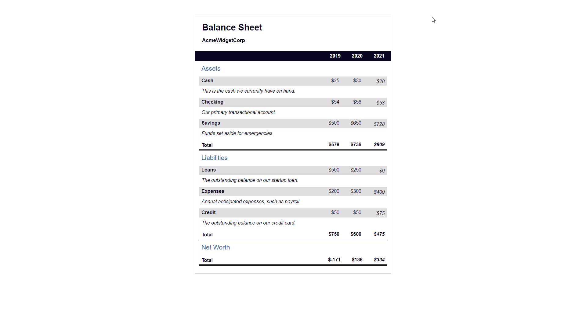

# **Balance Sheet** 🧾🧾🧾

## **Course Responsive Web Design (freeCodeCamp)** 🧑🏻‍🚀🚀

### In this course, I built a balance sheet using pseudo selectors. I learned how to change the style of an element when you hover over it with your mouse and trigger other events on your webpage.

---

 

### **Result Overview**

---

 

### **I learned about:**

- Pseudo Selectors
- Table

---

 

### _More About:_

- \<table>: The \<table> tag defines an HTML table.
- \<caption>: The \<caption> tag defines a table caption.
- \<thead>: The \<thead> tag is used to group header content in an HTML table.
- \<tbody>: The \<tbody> tag is used to group the body content in an HTML table.
- \<tr>: The \<tr> tag defines a row in an HTML table.
- \<td>: The <td> tag defines a standard data cell in an HTML table.
- \<th>: The <th> tag defines a header cell in an HTML table.
- A new way to select seletors: element[class~='class-name'].
- Pseudo-selector:first-of-type().
- Pseudo-selector:last-of-type().
- Pseudo-selector:nth-of-type().
- Pseudo-selector:not().
- The key difference between **element[class="class-name"]** and _**element.class-name**_ is that the first will select elements where the **only** class is class-name. The second will select elements where the class _**includes**_ class-name.

---

 

### _Important Links:_

- https://www.freecodecamp.org
