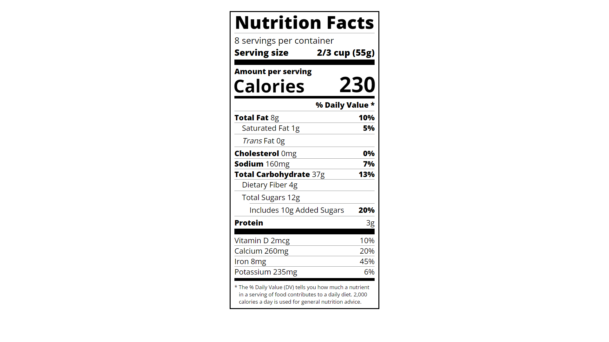

# **Nutrition Label** 🏷️🏷️🏷️

## **Course Responsive Web Design (freeCodeCamp)** 🧑🏻‍🚀🚀

### In this course, I used typography to build a nutrition label webpage. I learned how to style text, adjust line height, and position my text using CSS.

---

 

### **Result Overview**

---

 

### **I learned about:**

- Typography

---

 

### _More About:_

- Typography is the art of styling your text to be easily readable and suit its purpose.
- The rem unit stands for root em, and is relative to the font size of the html element.

---

 

### _Important Links:_

- https://www.freecodecamp.org
