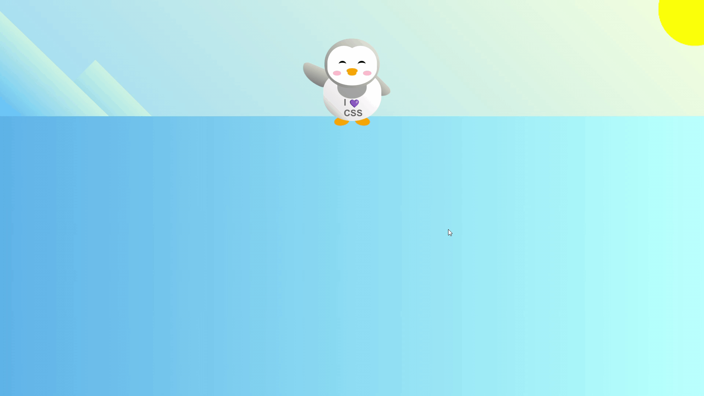

# **Penguin** 🐧🐧🐧

## **Course Responsive Web Design (freeCodeCamp)** 🧑🏻‍🚀🚀

### In this course, I built a penguin. I used CSS transforms to position and resize the parts of the penguin, created a background, and animated the work.

---

 

### **Result Overview**

---

 

### **I learned about:**

- CSS transform

---

 

### _More About:_

- transform: skew(0deg, 45deg);

---

 

### _Important Links:_

- https://www.freecodecamp.org
