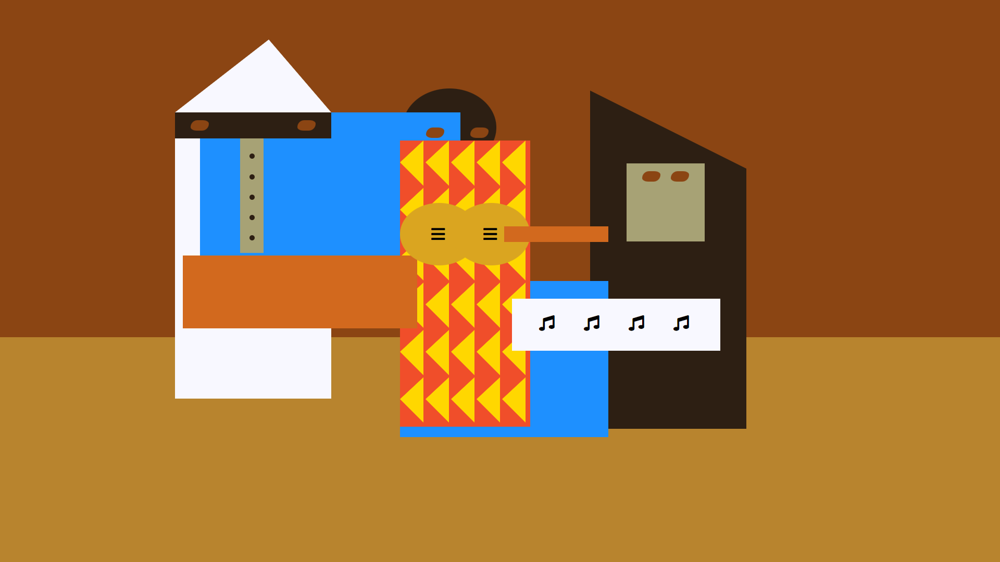

# **Picasso Painting** 🖼️🖼️🖼️

## **Course Responsive Web Design (freeCodeCamp)** 🧑🏻‍🚀🚀

### In this course, I learned how to use some intermediate CSS techniques by coding my own Picasso painting webpage. I learned about SVG icons, CSS positioning, and review other CSS skills.

---

 

### **Result Overview**

---

 

### **I learned about:**

- Position: absolute;
- z-index: ;

---

 

### _Important Links:_

- https://www.freecodecamp.org
